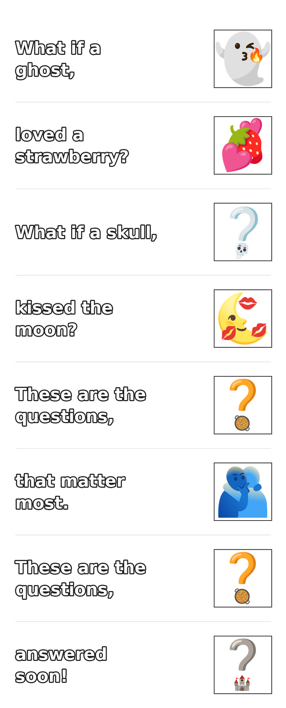

What if a ghost 👻 loved a strawberry? 🍓

What if a skull kissed the moon?

These are the questions that matter most.

These are the questions answered soon!

---

A collection of Python tools for browsing, searching, and living with [Google Emoji Kitchen](https://emojikitchen.dev/) mashups on your Linux desktop.

Emojikitchen has approximately 147,000 images. Many of them are *delightful*.

Here's how to use this script to make it easy to search and create them:

## Tools

| Script | What it does |
|---|---|
| `emoji-picker.py` | Keyword search → rofi thumbnail grid → set as wallpaper |
| `emoji-picker-semantic.py` | Same, using sentence embeddings for fuzzy matching |
| `emoji-picker-combined.py` | Combines CLIP + MiniLM for best results |
| `emoji-search.py` | CLI search, optionally sets wallpaper |
| `emoji-wallpaper.py` | Sets a random mashup as a tiled wallpaper each day |
| `emoji-story.py` | Converts text into a PNG strip, one emoji per phrase |
| `emoji-combined-daemon.py` | Persistent daemon that keeps models loaded in memory |

## Setup

Getting everything running requires a few one-time steps: downloading the metadata index (~94 MB), building semantic text embeddings (~216 MB, ~10 min), and optionally building CLIP image embeddings (~65 MB). Total cache footprint is around **570 MB**.

Copy the scripts to `~/.local/bin/`, then kick off the index build:

```bash
chmod +x *.py && cp *.py ~/.local/bin/
python3 ~/.local/bin/emoji-wallpaper.py   # downloads index, sets today's wallpaper
```

For semantic and CLIP search you'll also need a Python env with `sentence-transformers` and `torch` — a venv or conda/micromamba env both work. See **[docs/README.md](docs/README.md)** for the full step-by-step guide, including clipboard setup (xclip for X11, wl-clipboard for Wayland), how to build the embeddings, cache size breakdown, and wallpaper autostart setup.

Bind your picker of choice in i3 or sway:
```
bindsym $mod+shift+e exec --no-startup-id ~/.local/bin/emoji-picker-combined.py
```

---

*generated by `emoji-story.py`*


